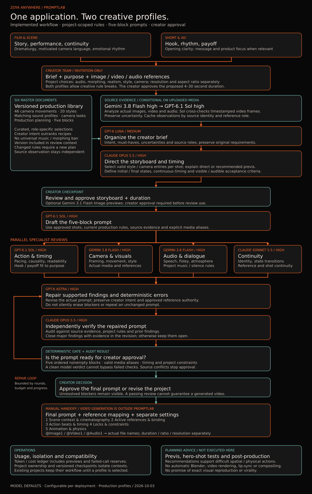

# Seedance Prompt Review Pipeline

An invitation-only web application for reviewing Seedance 2.5 prompts **before** an expensive video generation. The source repository is public; the deployed application and uploaded media are restricted to invited users.

> Status: first working application version. BytePlus video generation remains outside this release. Server/domain deployment and the creator video concept will follow later.



## Workflow

1. Human creators provide the brief, must-have requirements, optional image/video/audio references, target duration, resolution, and aspect ratio.
2. A deterministic validator checks media and task-specific BytePlus constraints. GPT-6 Luna structures the creator brief; GPT-6 Sol drafts a shot-by-shot storyboard. Each shot gets a visual scene card from the brief and available references; creators can request AI-generated previews for selected shots or the whole storyboard after seeing an estimated cost.
3. Creators edit and approve the storyboard, preview images, media roles, and output settings.
4. GPT-6 Sol drafts a prompt bound to that approved storyboard version.
5. Four independent specialist reviews examine action/timing, camera/visuals, audio/dialogue, and continuity.
6. GPT-6 Sol independently challenges the full context and specialist findings.
7. GPT-6 Sol supervises revisions. Unresolved critical conflicts are escalated to GPT-6 Astra. A deterministic Seedance linter checks structural rules.
8. Creators review the findings, remaining risks, and final prompt before approval.

The review loop defaults to three rounds (`MAX_REVIEW_ROUNDS`, allowed range 2–5) and has a cost ceiling. Another specialist round runs only after the supervisor changes the prompt. A last-round revision receives one targeted GPT-6 Sol audit; older findings do not automatically block a corrected prompt. Existing blocked last-round revisions can request that audit without repeating the entire agent team. Major or critical defects in the final text still block approval; persistent critical conflicts are escalated to Astra. Passing review reduces avoidable prompt errors; it cannot guarantee Seedance's output.

Creator instructions and uploaded references have priority over generated storyboard previews. Image generation is optional and starts only for selected shots or a creator-requested batch. Gemini 3.1 Flash Image is the initial candidate, pending access, pricing, and quality checks. The dashboard includes preview generation costs. Creators approve, replace, or reject previews before reviewers use them; rejection deletes the preview file while keeping its cost record. Previews are not automatically sent to Seedance as reference assets.

## Run locally

The application uses Python 3.12, FastAPI, LangGraph, PostgreSQL in Docker, and a dependency-free browser frontend. Keep the existing `.env` with API keys private. Add a strong random `POSTGRES_PASSWORD` to it; `.env.example` lists all variables. Docker must be running.

```sh
docker compose up --build -d
docker compose run --rm app python -m app.cli create-admin --email you@example.com --name "Your Name"
```

Open `http://127.0.0.1:8080` on the server itself. The Compose port binds only to loopback. Put a TLS reverse proxy in front of it before providing remote access, and keep `SECURE_COOKIES=true` in production. Domain and proxy configuration are intentionally deferred until server details are known.

For development without Docker, create a Python environment, install `requirements-dev.txt`, set `SECURE_COOKIES=false`, create an admin with the same CLI command, and run `uvicorn app.main:app --reload`. SQLite is used when `DATABASE_URL` and `POSTGRES_PASSWORD` are absent. Video/audio validation requires `ffprobe`; it is included in the Docker image.

Run checks with `python -m pytest -q` and `node --check app/static/app.js`. The CI workflow also builds the container, audits Python dependencies, and checks for obvious accidentally tracked secrets.

## Access and data flow

- Admins create one-time invitation links in the dashboard and send them manually. Passwords use Argon2id; sessions are server-side and use secure, HTTP-only cookies with CSRF protection.
- Each project belongs to one user. API routes check ownership or administrator access before returning briefs, reviews, or media. Shared-project roles are not implemented yet.
- Image, video, and audio uploads are validated and stored on the server. Gemini visual/audio specialists receive relevant uploaded media; other agents receive images and explicit metadata. Generated storyboard previews are stored separately from source references and enter review only after creator approval.
- The review runs in the application process with three specialist rounds by default. A restart marks interrupted reviews as failed so they can be rerun. A durable worker queue and database migrations are planned before multi-instance production deployment.
- The usage ledger records provider-reported tokens and a versioned rate estimate. The pre-call budget uses a conservative heuristic; actual invoices can differ for multimodal inputs, retries, and provider price changes. Preview images use an initial 1K-image estimate of about $0.067 each.

No model call starts just by opening a project. Creators explicitly trigger storyboard drafting, optional preview images, and prompt review.

## Interface and responsive design

The application follows the current [Zoyanywhere website](https://zoyanywhere.com/) visual language: charcoal `#161616`, vivid orange `#FB4E04`, warm cream `#FFF7F2`, white, Anton display headings, and Inter body text. Design tokens stay configurable, and contrast and focus states must remain accessible. The interface should feel like a modern creator workspace: generous spacing, clear hierarchy, calm surfaces, restrained motion, and focused orange accents. Review status, critical findings, and cost remain easy to scan; advanced detail appears when needed.

Selective 3D depth is part of the visual direction: a spatial dashboard illustration, subtle perspective on storyboard shot cards, and an optional interactive view when it helps explain framing or camera motion. Forms, findings, costs, and approvals stay flat and readable. Heavy scenes load on demand, reduced-motion preferences are respected, and a static 2D fallback keeps the full workflow usable on phones and low-power devices.

The complete workflow must work on desktop and mobile. On phones, brief entry, reference uploads, storyboard shots, preview approval, agent findings, cost dashboard, and final approval use a single-column layout without horizontal page overflow. Desktop uses its wider space for shot timelines and side-by-side reference and preview comparison. Verify 360, 390, 768, and 1280 CSS-pixel widths and touch targets of at least 44 × 44 CSS pixels.

## Implementation and later phases

- LangGraph for the bounded review graph; the application database stores storyboard versions, reviews, usage, and human approval decisions.
- OpenAI GPT-6 Luna, Sol, and Astra; Anthropic Claude Sonnet 5.5; Google Gemini 3.8 Flash. Transient Gemini 3.8 overloads are retried, then routed to Gemini 3.5 Flash and 3.5 Flash-Lite if needed; the actual successful model and attempt count appear in usage records. Google currently limits Gemini 2.5 access for new users.
- Docker deployment, invitation-only accounts, project ownership checks, server-side API keys, and private local media storage. Admins create expiring invitation links and send them manually.
- A usage dashboard showing input, output, cache, and reasoning tokens where available; estimated cost per call, agent, round, and complete review; and pre-call budget checks.
- BytePlus Seedance 2.5 API integration in a later phase.

Configurable media retention, account/project sharing, durable background workers, and database migrations are follow-up implementation work before production deployment. The current server/domain deployment remains undecided.

Before accepting public-server uploads, add an isolated antivirus scanner (for example ClamAV) that scans every file before storage and fails closed when unavailable. Current limits, content inspection, private storage, and container restrictions remain in place. Antivirus signatures cannot detect prompt injection in a brief or media; agents must treat embedded text and speech in references as untrusted source content, and media decoders still need isolation and updates.

See [the machine-readable project brief](project-brief.en.json) for roles, gates, and source boundaries.

## Seedance-specific constraints

The active task type determines valid settings. Text-to-video and reference-to-video can use creator-selected ratios such as 16:9 and 9:16. Seedance 2.5 editing, extension, and first-frame workflows require `adaptive` ratio; editing requires automatic duration. The first release validates these rules and media references without starting video generation. Current [BytePlus documentation](https://docs.byteplus.com/en/docs/modelark/video-generation-tutorial) is the authority for API and model constraints. Its official Seedance 2.5 prompt guide and skill take priority over community templates.

## Secrets and public repository

Never commit `.env`, API keys, uploaded media, or user prompts. Use `.env.example` for variable names only. The application must load keys on the server and keep all review and media data behind authentication.

## Container security and upgrades

The app image uses a multi-stage build and version-pinned Python base image. The app runs as a dedicated non-root user with a read-only root filesystem, an explicit media volume, dropped Linux capabilities, `no-new-privileges`, a health check, and resource limits. PostgreSQL is reachable only on an internal network. The app listens on the host loopback interface, ready for a TLS reverse proxy at deployment. Containers do not receive the Docker socket or privileged mode.

Dependencies and base images receive weekly Dependabot update PRs. CI checks builds, tests, dependency advisories, container vulnerabilities, and obvious accidental secrets. Production upgrades should use reviewed immutable images with a rollback path; application containers do not silently self-update at startup. See the [project brief](project-brief.en.json) for the full security and maintenance requirements.

Dependabot PRs can auto-merge after both required CI jobs (`test` and `container`) pass for the current PR head. Branch protection must require those checks; the auto-merge workflow does not check out or execute PR code with write permissions.
